# Evidencias — TP1

## 1. Push directo a main rechazado
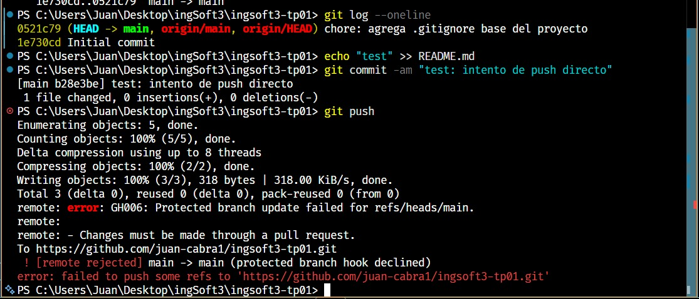
GitHub rechaza el push porque main está protegida y la regla alcanza también al dueño del repo.

## 2. El PR de la rama B no se puede mergear: conflicto
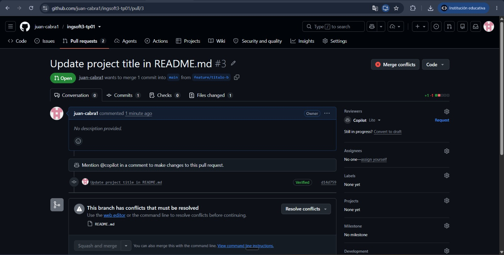

## 3. Resolucion de conflictos
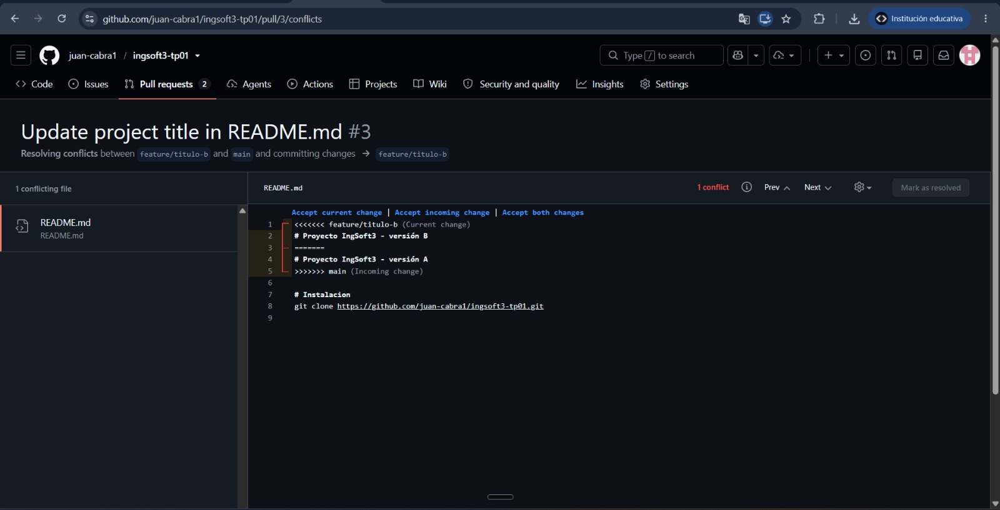

## 4. Release publicada
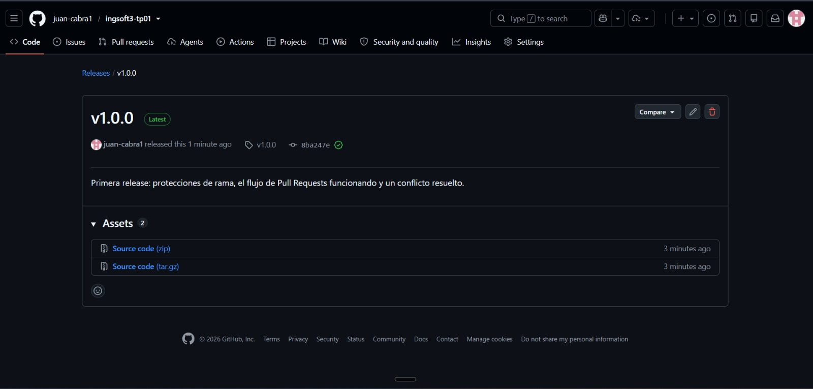

# Evidencias - TP2
## 1. docker compose up -d desde cero
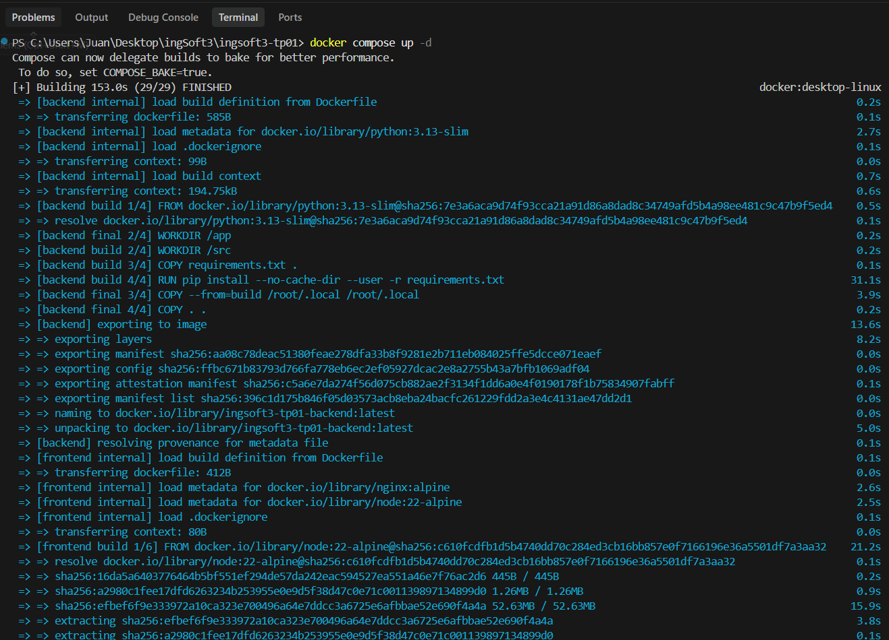
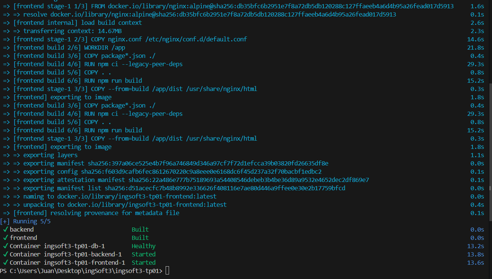
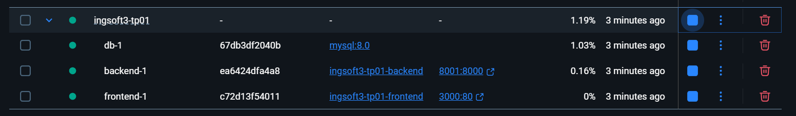

## 2. Prueba de persistencia 
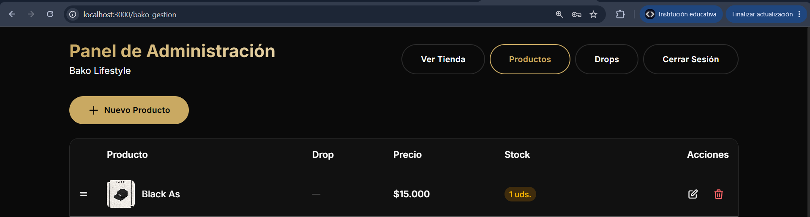
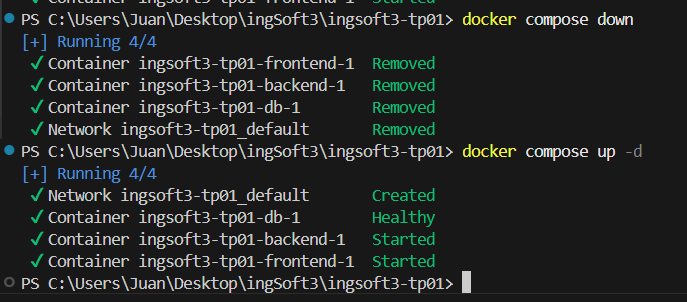
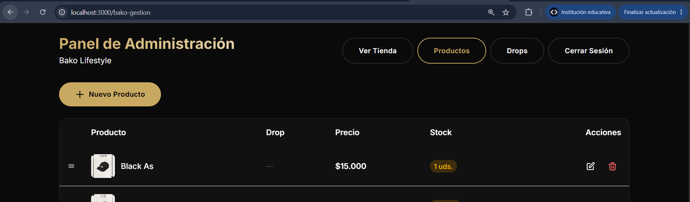

## 3. Comparacion de tamaño imagen final vs imagen de SDK
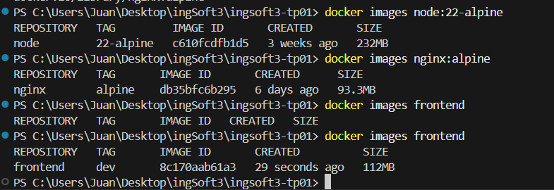

## 4. Imagenes publicadas en el registry
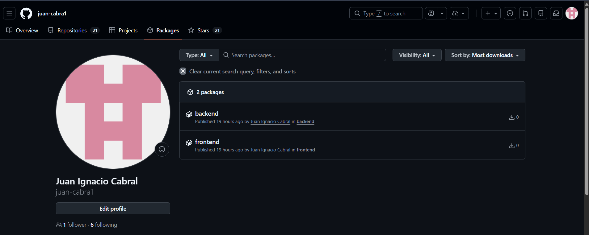